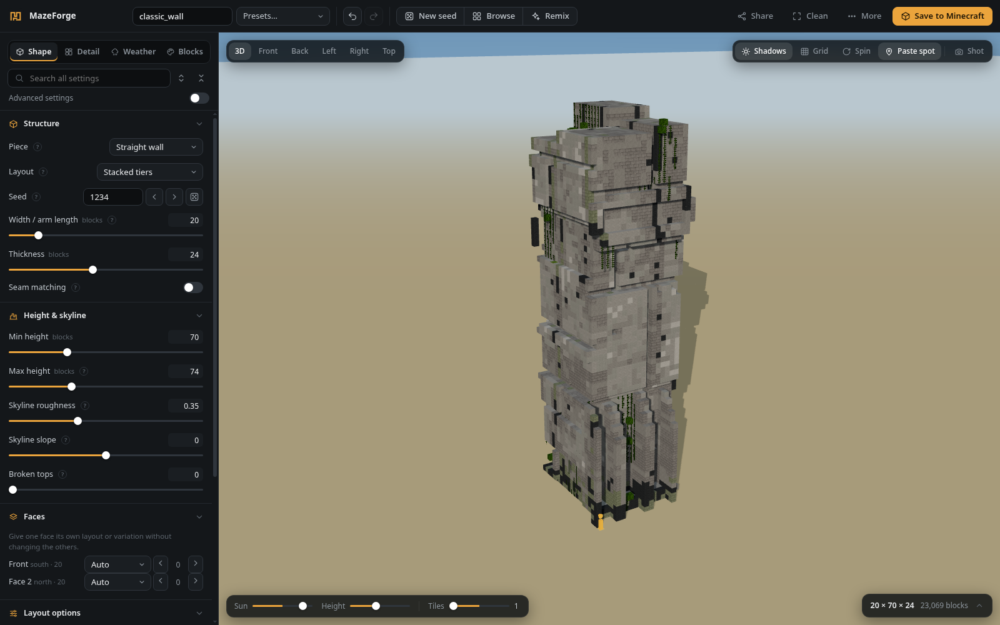

# MazeForge

> **Beta software — bugs are expected.** Features and compatibility are still being tested. Back up your Minecraft world before pasting structures, and [report bugs](https://github.com/OpenNerdz/mazeforge/issues).

**[Download MazeForge Beta — Windows, macOS and Linux](https://github.com/OpenNerdz/mazeforge/releases/tag/v2.0.1-beta.1)**

**Build atmosphere, one block at a time.**

Design weathered walls, junctions and seeded mazes for Minecraft Java Edition.
Shape the skyline, simulate rain and ivy, preview your structure in 3D, then export
it as a WorldEdit `.schem` file. Runs locally in your browser, with no account,
cloud service or telemetry.

[All releases](https://github.com/OpenNerdz/mazeforge/releases)
· [Texture setup](docs/TEXTURES.md)
· [Report an issue](https://github.com/OpenNerdz/mazeforge/issues)



## Start building

1. Open [Releases](https://github.com/OpenNerdz/mazeforge/releases) and download the **desktop file for your system**.
2. **Extract the entire download**.
3. Double-click the app below. Your usual browser opens automatically.

**No coding, terminal commands, Python installation or account is needed for the desktop downloads.**

| System | Launcher |
| --- | --- |
| Windows 10/11, x64 | Download `windows-x64.zip`, extract it, then double-click **MazeForge.exe**. |
| Mac with Apple Silicon | Download `macos-arm64.zip`, extract it, then double-click **MazeForge.app**. |
| Mac with Intel | Download `macos-x64.zip`, extract it, then double-click **MazeForge.app**. |
| Linux, x64 | Download `linux-x64.tar.gz`, extract it, then double-click **MazeForge**. |

Desktop builds are tested on Windows, macOS 15 (both architectures) and Ubuntu 22.04.
Linux needs a desktop browser and glibc 2.35 or newer; Alpine/musl and ARM Linux
are not supported by these binaries. Use a current Chrome, Edge or Firefox browser
with WebGL 2 enabled. Desktop downloads include Python and the app assets.

**First launch:** beta builds are unsigned. Windows may show SmartScreen;
macOS may ask you to approve the app in **System Settings → Privacy & Security**.
Only approve a download you trust from this repository; never disable system protections.
Linux file managers may ask you to allow launching an executable. Approval rules
depend on your system, so a completely prompt-free launch cannot be guaranteed.

The workspace opens at <http://127.0.0.1:8765>. Choose **More → Quit MazeForge**
to stop the desktop app; closing a browser tab leaves it running. Double-clicking
the app again reopens the workspace. No administrator privileges are required.

<details>
<summary>Run from source instead</summary>

The source ZIP (`mazeforge-<version>.zip`, without an OS name) requires
[Python 3.10 or newer](https://www.python.org/downloads/). Start `start.bat` on
Windows, `bash start.command` on macOS or `bash start.sh` on Linux. Stop it with
**Ctrl+C** in its terminal. Node.js and npm are needed only for development.

</details>

Choose a preset, adjust the settings, then select **Save to Minecraft** or
**More → Download .schem**. In Minecraft, stand on the orange paste marker shown
in the preview, face north, and run:

```text
//schem load studio/<name>
//paste -a
```

**Compatibility:** Minecraft Java Edition with a matching version of WorldEdit.
The bundled preview library targets 1.20.1, and all default palettes use vanilla
blocks. Import your version's client JAR to use its textures and block catalog.
Export compatibility also depends on the target game's block IDs and states;
older editions and Bedrock need different formats.

## What you can make

- Straight walls, corners, T-junctions, crossroads and complete mazes with an optional central glade.
- Layered concrete panels, towers, passages, broken tops, lettering and per-face layouts.
- Rain streaks, moss and ivy that follow the surfaces of the structure.
- Matching seams between neighbouring walls, even with different seeds.
- Custom palettes, with automatic sorting into shade bands and material roles.
- Seed variations, batch exports, share codes and large designs split into aligned chunks.

The release includes original preview materials. For authentic Minecraft textures,
use **More → Minecraft textures → Choose client JAR**. [Texture setup](docs/TEXTURES.md)
explains where launchers keep these files.
Imported textures stay on your computer and are excluded from Git and release packages.
The materials you see in the preview do not change the block IDs exported to Minecraft.

[See a complete maze in the workspace](docs/screenshot-maze.png).

## Your workspace

The top bar contains presets, undo and redo, seed controls, sharing and saving.
The left panel has **Shape**, **Detail**, **Weather** and **Blocks** tabs. Enable
**Advanced settings** for fine control, or use the search box to find a setting.
Double-click a slider to reset it. Orange dots mark changed settings.

The details card shows paste commands and a material list. Select a block to isolate
it in the preview, or copy the list for a survival build. **Clean UI** hides secondary
controls. Settings and custom presets are remembered in your browser.

| Key | Action | Key | Action |
| --- | --- | --- | --- |
| R | New seed | Ctrl+S | Save to Minecraft |
| M | Remix | E | Download `.schem` |
| B | Seed browser | P | Screenshot |
| C | Clean UI | 1–6 | Camera views |
| ? | Shortcuts | Ctrl+Z / Ctrl+Shift+Z | Undo / redo |

Share links point to the local app address: the recipient must start their own copy
of MazeForge before opening the link. Existing `MSS1` share codes and saved
browser settings remain compatible.

## Saving and privacy

**Save to Minecraft** shows folders you have added. **Find game folders** checks
standard launcher locations only when clicked, including the official launcher,
Prism, MultiMC, PolyMC, CurseForge, Modrinth App, ATLauncher, GDLauncher and Technic.
It does not search Documents, Desktop or unrelated folders. Portable, moved and
custom game or server installations can be added using **Browse** or a full path.
WorldEdit mod and plugin folders are recognized inside the selected installation;
you can also choose a schematic folder directly.

Saving writes only to the folders you select. Existing schematics are preserved unless you enable **Overwrite**. For large designs, enable chunked saving and paste each chunk
from the same marked position. A copy of successful saves is retained in `exports/`.
Added folder paths are stored locally in `folders.json`; both are excluded from Git.

Desktop downloads keep `folders.json`, `exports/` and `local-textures/` in your
own application data folder, so updates and moving the app preserve your data:

| System | Local data folder |
| --- | --- |
| Windows | `%LOCALAPPDATA%\MazeForge` |
| macOS | `~/Library/Application Support/MazeForge` |
| Linux | `$XDG_DATA_HOME/mazeforge`, or `~/.local/share/mazeforge` |

The source version keeps this data beside the app (`web/local-textures/` for imports).

The server binds to `127.0.0.1`, accepts local host/origin requests, and serves only
the web directory. No files or settings are uploaded. Keep it running on your own
computer; it is a desktop companion, not an internet-facing server.

## Troubleshooting

- **Asked to install Python:** you downloaded the source ZIP. Choose the desktop download for your system instead.
- **Blank preview:** enable browser hardware acceleration and WebGL 2, update the browser, and reload. Check that you extracted every file.
- **Port already in use:** close another copy of the app or the program using port 8765.
- **Unknown blocks in Minecraft:** import the client JAR for the version you play, and use blocks available in that version.
- **Folder picker unavailable:** paste the full path instead. Linux desktop dialogs use Zenity or KDialog when available; no extra packages are needed for manual paths.

## How generation works

<details>
<summary><b>Pieces and mazes</b></summary>

Every piece goes through the same footprint builder:

1. The outline is traced into faces.
2. Each face gets its own design.
3. The ends are capped.
4. Corners carry one design round continuously.

*Width* is the outside length of an arm. *Show attached walls* previews a junction joined to straight walls;
only the piece itself is exported.

**Whole maze** sets the grid size, corridor width and wall width, and *Loops* sets how many dead ends are opened up.
It can also add a central **Glade** with a gate in each side.
</details>

<details>
<summary><b>Skyline, seams and faces</b></summary>

- *Skyline roughness* steps the top slabs up and down.
- *Skyline slope* tilts the whole top one way.
- *Broken tops* knocks ragged chunks out of the top edges.
- *Seam matching* gives both ends of a straight wall the same joint profile. Walls with different seeds then line up
  end to end, as long as they use the same *Seam pattern*.
- The **Faces** section can give any single face its own layout or variation.
- *Panel distinction* makes every slab read as its own cast panel.
</details>

<details>
<summary><b>Rain, dirt and ivy</b></summary>

- **Where the rain goes.** Rain lands on every top open to the sky.
  - It collects at a few drip points and runs down the face below, spreading as it falls.
  - It drips again from any ledge it lands on.
  - It creeps back along the undersides of ledges.
- **What changes the dirt.** Wind drives rain onto the faces it blows at, and sun dries the south faces.
  Heavy flow washes the middle of a streak cleaner than its edges.
- **What grows.** The same wet paths decide where moss and ivy grow.
  - Ivy takes root on the ground, on ledges and in cracks.
  - It branches and wraps round corners.
  - It favours shade and damp.
- **Every vine is attached to something.** Each one sits on a real face, and leaves are exported as persistent,
  so nothing drops after pasting.
- **Sliders only change what they touch.** Each block's randomness is fixed to its position,
  so moving a rain slider changes only the blocks the water reaches.
</details>

## How it's built

The app is plain JavaScript modules served as they are: there is no build step, and Python 3 is the only thing needed to run it.

- **Generation runs in a background worker** (`web/worker.js`). The page sends the settings; the worker generates the design,
  turns it into a mesh and sends both back without copying them. Only the newest settings are ever built: changes made during
  a build collapse into one follow-up request, so dragging a slider stays smooth.
- **Meshing** (`web/core/mesh.js`) keeps only block faces that can be seen and merges neighbouring faces with the same texture
  into one quad (greedy meshing). Each vertex is four 16-bit numbers: position plus texture layer and face direction.
  The shader works out normals and texture coordinates from those.
- **Rendering** (`web/ui/viewer.js`, three.js). All block textures come from one atlas and sit in a single texture array,
  so each of the three passes (opaque, cut-out for leaves, vines and bars, and glass) is a single draw call. Frames are drawn only when
  something changes, and shadows are redrawn only when the structure or the sun moves.
- **Determinism**: every random choice comes from the seed, and most come from a fixed roll per block position, so a slider only
  changes the blocks it affects. The tests fingerprint the exact output of several designs.

## Development

Requires Node.js 22+ and Python 3.10+. The committed app runs without a build step;
its bundled three.js renderer is included.

```sh
npm ci
npm test                     # generation, schematic round trips, seams, weathering, meshes
npm run test:server          # local HTTP boundary and saves in disposable directories
npm run check                # JavaScript lint and type checks
uvx ruff check               # Python lint (or install Ruff separately)
python3 tools/build_preview.py  # regenerate original release preview materials
npm run vendor              # rebuild the renderer after updating three.js
npm run package             # portable ZIP + SHA256SUMS.txt in dist/
```

The original preview atlas is deterministic. The in-app texture importer reads only the client JAR you select and stores its preview
in the ignored `web/local-textures/` directory; see [texture setup](docs/TEXTURES.md).
Never commit or distribute imported game assets. The packaging script uses an explicit
file allowlist, so personal exports, folder paths, game assets, dependencies and Git
metadata are excluded even when present in your working folder.

GitHub Actions runs lint, type checks, generation tests, local server tests on Linux,
Windows and macOS, a dependency audit, preview reproducibility, packaging, and secret scans.
See [CONTRIBUTING.md](CONTRIBUTING.md) for contribution guidance and
[SECURITY.md](SECURITY.md) for reporting security issues.

## License and credits

MazeForge code, branding and original preview materials are licensed under the
[MIT License](LICENSE). The renderer includes three.js under its own MIT license;
see [third-party notices](THIRD_PARTY_NOTICES.md).

Minecraft names identify the compatible game. Locally imported
assets remain the property of their respective owners and are outside this project's
license. Refer to the [Minecraft usage guidelines](https://www.minecraft.net/en-us/usage-guidelines)
when using game assets.

**NOT AN OFFICIAL MINECRAFT PRODUCT. NOT APPROVED BY OR ASSOCIATED WITH MOJANG OR MICROSOFT.**
